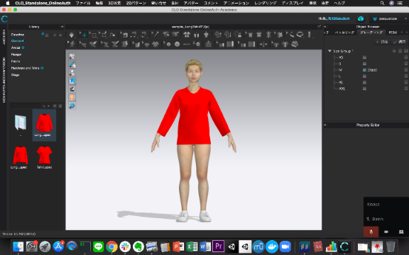
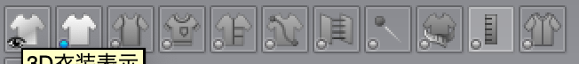

# CLO の設定
デスクトップにアプリがあり、アカウント発行済み＋ログインできる状態であるとする。
1. zprj/sample_hogehoge.ZPrj を一つ開く
1. CLOの設定 > ユーザ設定 > ショートカット >  3D衣装 >  全パターン再配置に ctrl+Rを登録
1. CLOの設定 > ユーザ設定 > ショートカット >  アバター > アバターの編集に ctrl+A を登録
1. CLOのMacのデスクトップ1に画面いっぱいに配置 ( ctrl + 1 でDesktop1に遷移するか確認 )
1. システム環境設定 -> ディスプレイ -> 解像度 変更 1440x900 にする。
1. 右上のObject Browser の→を連打してグレーディングを選択する。
1. 右下の3Dというマークをクリックする。
1. 4~6を行うと下図のような図になる。
1. command+shift+S して、適当な名前で保存する（保存した先がデータセットが溜まっていく場所 your_dir になる）
1. スタート前にグレーディングのボタンを何度か押して挙動を確認しておく。




# Python の設定
```
pip install pyautogui==0.9.48
python automator_CLO.py --dir test --mm --sizedataset test.csv --img_path test.Zprj --clothtest
python automator_CLO.py --dir test --mm --sizedataset test.csv --img_path test.Zprj
python automator_CLO.py --dir your_dir --mm --img_path your_zprj.Zprj  # 本番(普通)
python automator_CLO.py --dir your_dir --mm --img_path your_zprj.Zprj --start_idx n  # 本番(n番目から)
python automator_CLO_pichi.py --dir your_dir --mm --img_path your_zprj.Zprj  # 本番(ピチ)
```

# 補足1
もしも服に線が入っていたら、左上の服のアイコンをクリックして青色に光っているアイコンを下図のようにしてください。


# 確認方法
```
python
>>> import pyautogui as pg
>>> pg.position()
```

